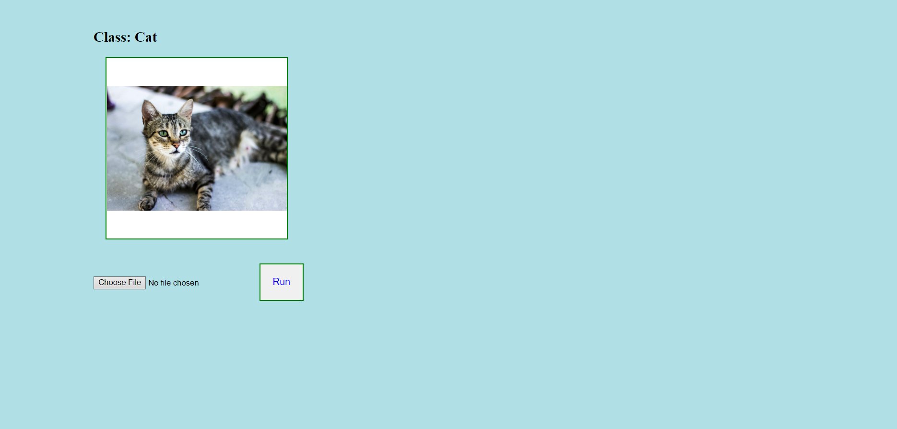
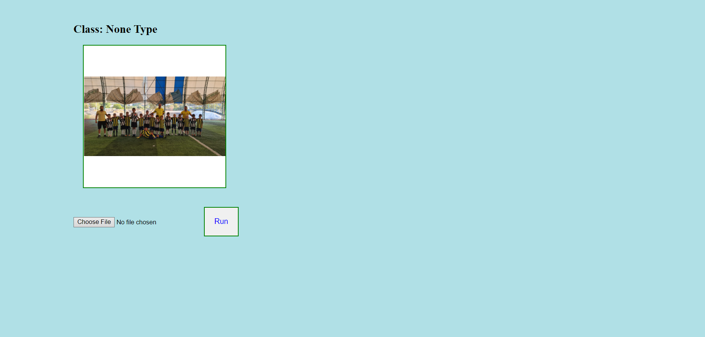

# Cats-and-Dogs-Keras-Flask-Exercise

You can upload image in website.And Website make classification by cat or dog.If your image without Cat or Dog , Result is gonna be None Type

Html page dont showing image.If I can fix that, website will show uploaded image

 <!-- Jquery Cdn -->

        

           .image {
        width: 100%;
    height: 100%;
    object-fit: contain;
    overflow"
      }
